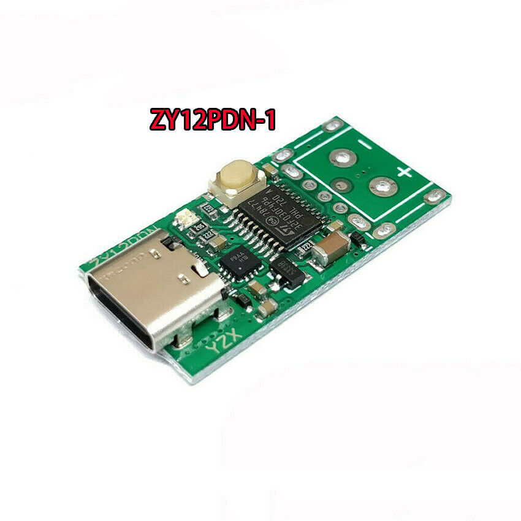
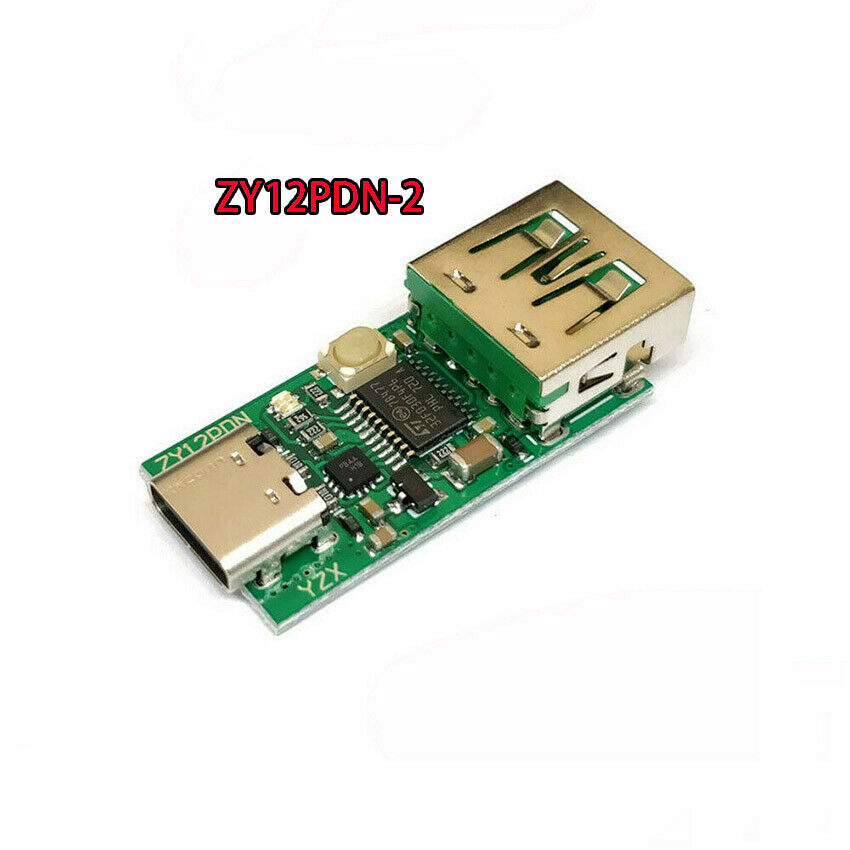
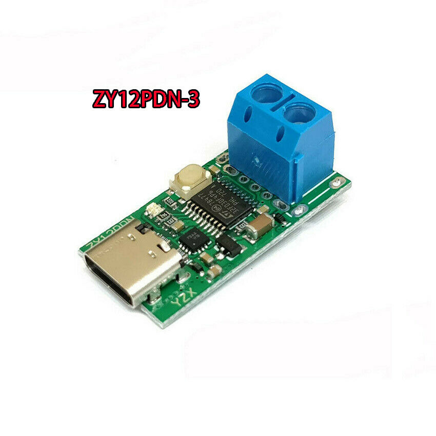
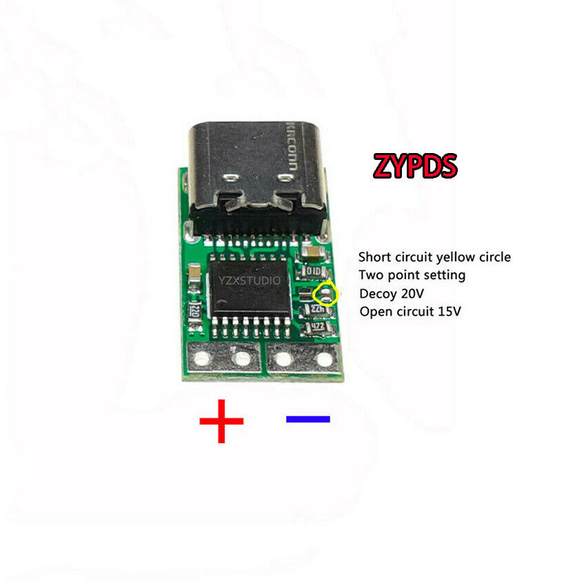

# Some notes on USB-PD triggers

I haven't been able to find good, detailed info about the USB-PD triggers people are using online, so I figured I'd document it here to save you some trouble!

GreatScott's video: https://www.youtube.com/watch?v=OwAZqJ4wpJg

eBay listing I purchased from: https://www.ebay.com/itm/333247140116

## ZY12PDN, ZY12PDN-1, ZY12PDN-2, ZY12PDN-3

These usually cost a bit more (starting around $8 USD) but are the most customizeable.  It claims to be able to supply 5A. There is a button and RGB LED which helps you determine the selected output voltage.

### Changing the default voltage

Press and hold the button as you insert your USB-PD compatible USB-C cable. The RGB LEDs should flash quickly. Release the button. You are now selecting the default operating mode of this circuit. Pressing the button will move to the next default mode. Holding the button will turn off the LED and select the current mode as the default.

* Red: 5V is selected by default. **Clicking the button will cycle the output voltage through all available voltage options.**
* Yellow: 9V is selected by default. Clicking the button does not change the output voltage.
* Green: 12V is selected by default. Clicking the button does not change the output voltage.
* Light Blue: 15V is selected by default. Clicking the button does not change the output voltage.
* Dark Blue: 20V is selected by default. Clicking the button does not change the output voltage.
* Purple: Highest available voltage is selected by default. Clicking the button does not change the output voltage.
* White: Demo mode - Automatically cycle through all available voltages, starting with 5V and increasing. Changes roughly once per second.

After you have made your selection for the default operating mode, unplug and replug your USB-C cable to confirm the expected behavior/color.

If you plug it into a non USB-PD 5V power source, the LED will flash blue after ~4 seconds to warn you there is no USB-PD support. It appears to still pass through the 5V power normally.

## ZYPDS

This is the cheapest option ($2.50 USD), but offers very limited customization. It claims to be able to supply 5A.

It appears to support all the voltage options for USB-PD: 5V, 9V, 12V, 15V, and 20V. It will always select the highest voltage possible from the PD source.

As indicated in the photo above, there is a small pad you can bridge with solder to restrict the maximum voltage it outputs. By default, mine defaults to 20V with no solder bridge.  So I believe if you bridge those yellow circled pads, you can restrict the output voltage to 15V. The only way to get 12V, 9V, 5V is by using a USB-PD power source that can only provide those voltage configurations.

The 4 holes on the output side are 0.1" spaced and breadboard-compatible.

It appears to still pass through the 5V power normally, if you plug it into a non USB-PD 5V power source.
